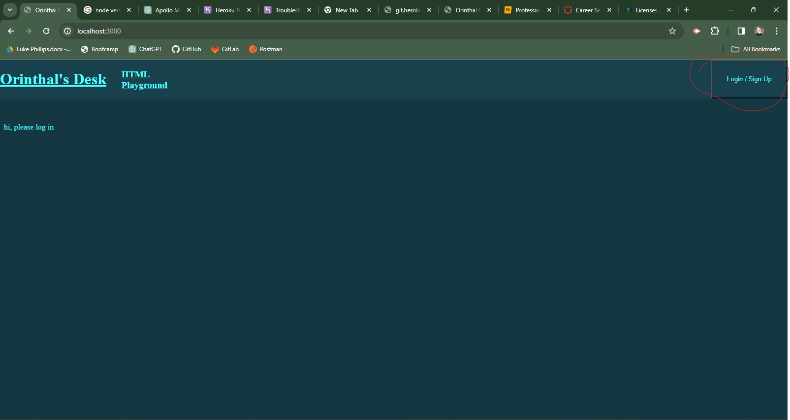
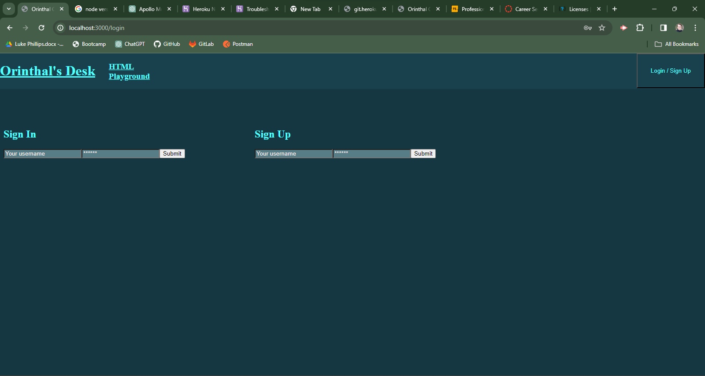
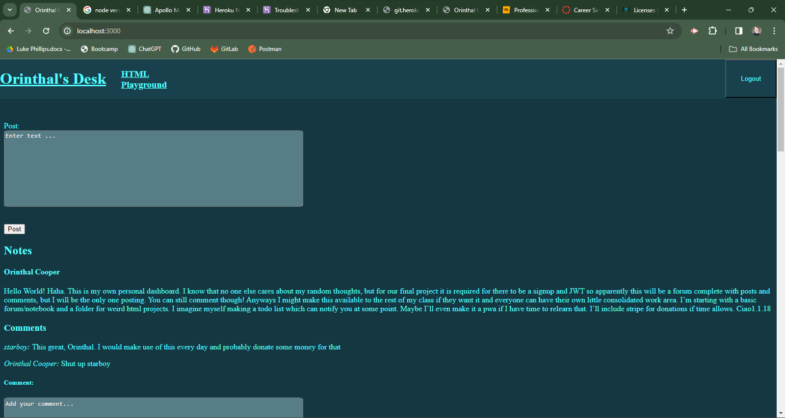
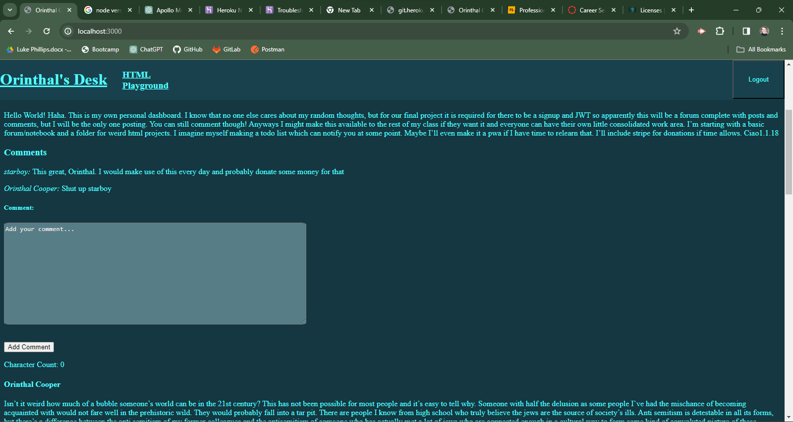

# Orinthal's Desk
## Description
This app is a creative project combining technical coding skills and my love for true-crime / horror. I also put a lot of thought into making it have a polished, satisfying look to it. This was a great exercice in React, JWT, building CSS from scratch, using Apollo queries and mutations, and tying this knowledge all together to make a full stack web application.
## Installation
To get running, simply run npm i at root level and run npm build, then npm run develop.
## Usage
Upon launch you should land on a page asking you to log in

Either log in or sign up 

Post functionality is only available to one user (me), but anyone can leave a comment

## Credits
I'd like to thank George Yoo, Dan Kaltenbaugh and Alexis Gonzalez for helping me to get the back end up and running and Anthony Ciccone for helping me develop ideas in the beginning and give me motivation to do this project alone
## License
Licensed under the MIT License, Copyright © 2023-present Luke Phillips